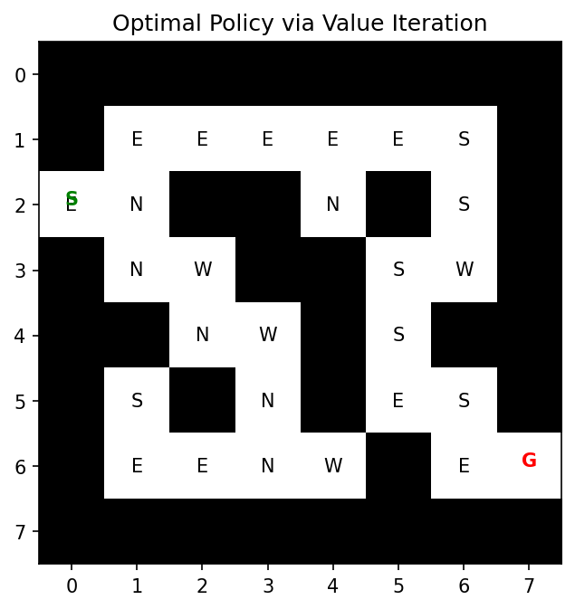
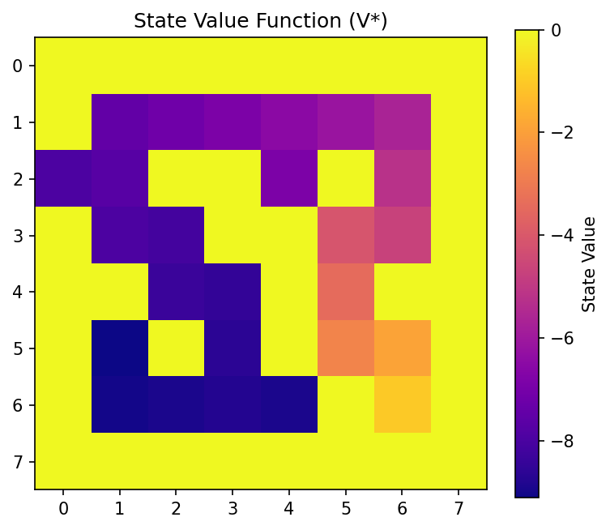
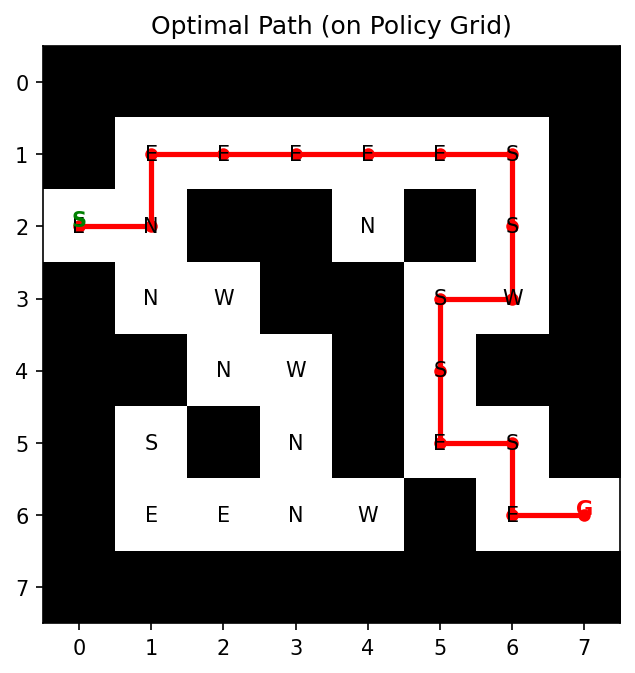
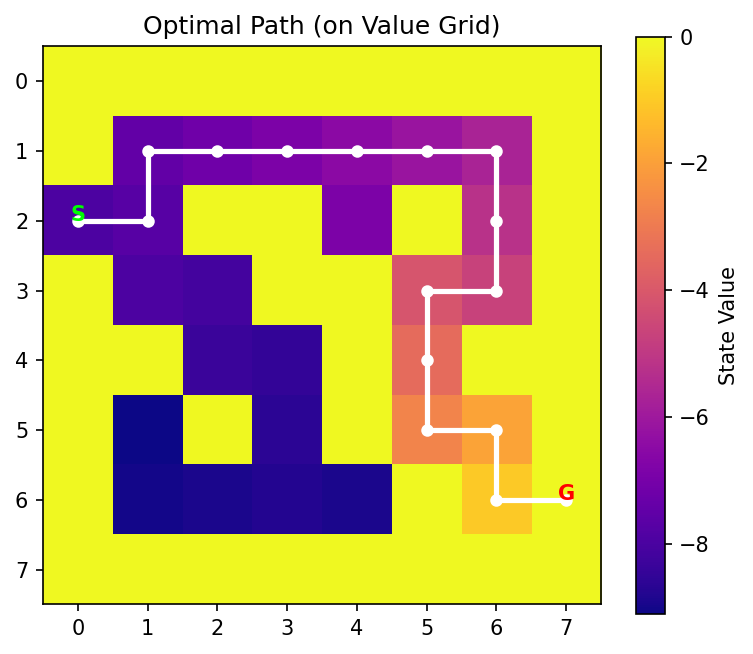

# 强化学习与博弈论课程 实验报告
## 一. 实验目标
本实验旨在通过建立一个基于马尔可夫决策过程（Markov Decision Process, MDP）的二维网格迷宫环境，利用价值迭代算法（Value Iteration）求解智能体从起点到终点的最优路径问题。实验目标包括：
1. 掌握MDP基本概念与状态转移建模
2. 实现价值迭代算法的收敛过程
3. 对比不同网格结构下的最优路径方法

## 二. 实验原理

### 1. 马尔可夫决策过程（Markov Decision Process, MDP）
马尔可夫决策过程是一个五元组：

$$
\mathcal{M} = \langle S, A, P, R, \gamma \rangle
$$
其中：
- $S$：状态空间（state space），表示智能体所处的所有可能位置；
- $A$：动作集合（action space），表示在每个状态下可选择的动作；
- $P(s'|s,a)$：状态转移概率函数，表示在状态 $s$ 执行动作 $a$ 后转移到状态 $s'$ 的概率；
- $R(s,a)$：奖励函数（reward function），表示在状态 $s$ 执行动作 $a$ 后获得的即时奖励；
- $\gamma \in [0,1]$：折扣因子（discount factor），控制未来奖励的重要程度。

智能体的目标是最大化期望累计奖励（expected return）：
$$
G_t = \sum_{k=0}^{\infty} \gamma^k R_{t+k+1}
$$

### 2. 动态规划求解
若环境模型（$P, R$）已知，可通过值迭代（Value Iteration）或策略迭代（Policy Iteration）方法求解最优策略。
#### （1）值迭代算法

根据 **Bellman 最优方程**（Bellman Optimality Equation）：

$$
V^*(s) = \max_{a \in A} \left[ R(s,a) + \gamma \sum_{s'} P(s'|s,a)V^*(s') \right]
$$

通过迭代更新价值函数，直到收敛为止。**最终策略**为：
$$
\pi^*(s) = \arg\max_a \left[ R(s,a) + \gamma \sum_{s'} P(s'|s,a)V^*(s') \right]
$$
---
#### (2) 策略迭代算法

策略迭代分为两步：策略评估（Policy Evaluation） 与 策略改进（Policy Improvement）。

**策略评估公式**：
$$
V^{\pi}(s) = \sum_{a} \pi(a|s) \left[ R(s,a) + \gamma \sum_{s'} P(s'|s,a)V^{\pi}(s') \right]
$$

**策略改进规则**：

$$
\pi'(s) = \arg\max_a \left[ R(s,a) + \gamma \sum_{s'} P(s'|s,a)V^{\pi}(s') \right]
$$

当策略稳定（即 $\pi' = \pi$）时，即得到最优策略 $\pi^*$。

---

### 3. 网格环境建模（Grid World Environment）

实验中，网格世界可抽象为：

- 状态空间 $S = \{ (x, y) | 0 \le x < M, 0 \le y < N \}$
- 动作集合 $A = \{ \text{up}, \text{down}, \text{left}, \text{right} \}$

状态转移模型为：

$$
s' = f(s, a) =
\begin{cases}
(x+1, y), & a = \text{down} \\\\
(x-1, y), & a = \text{up} \\\\
(x, y+1), & a = \text{right} \\\\
(x, y-1), & a = \text{left}
\end{cases}
$$

若动作越界或遇障碍，则保持当前位置 $s' = s$。

奖励函数设计为：

$$
R(s, a, s') =
\begin{cases}
+10, & s' = s_{goal} \\\\
-1,  & \text{otherwise}
\end{cases}
$$

---

### 4. 数学直观总结

- **状态价值函数（Value Function）**：
  $$
  V(s) = \mathbb{E}[G_t | S_t = s]
  $$

- **动作价值函数（Q Function）**：
  $$
  Q(s,a) = \mathbb{E}[R_{t+1} + \gamma V(S_{t+1}) | S_t=s, A_t=a]
  $$

- **最优策略（Optimal Policy）**：
  $$
  \pi^*(s) = \arg\max_a Q^*(s,a)
  $$


## 三. 算法说明
实验主要使用以下函数：
| 函数名 | 功能说明 |
|---------|-----------|
| `build_maze()` | 构建迷宫环境矩阵，1 表示障碍，0 表示可通行单元。返回起点与目标点坐标。 |
| `step(maze, state, action)` | 定义状态转移函数，根据动作返回新状态及即时奖励。 |
| `value_iteration(maze, start, goal, theta)` | 实现值迭代核心算法，不断更新状态价值函数，直到收敛。 |
| `extract_policy(V, maze, goal)` | 从价值函数中提取最优策略，对每个状态选取最优动作。 |
| `visualize(V, policy, maze, start, goal)` | 绘制迷宫与最优策略方向箭头，实现策略可视化。 |
| `plot_optimal_path(policy, start, goal)` | 【新增函数】根据最优策略生成路径序列并以折线/箭头标注出完整线路。 |

## 四. 创新说明
在传统MDP实验中，通常只输出状态价值或最优动作方向矩阵，无法直观的反映完整路径
本次实验中新增函数：plot_optimal_path()，实现：
1. 从起点出发，依照最优策略迭代移动；
2. 保存路径序列；
3. 使用plt.plot()与plt.arrow()绘制连贯轨迹；
4. 支持在两种grid（策略可视化图与价值函数热力图）中分别叠加最优路径。
路径生成公式如下：

$$
s_{t+1} = f(s_t, \pi^*(s_t)), \quad t = 0, 1, 2, \dots, T
$$

直到：

$$
s_T = s_{goal}
$$

代码实现如下：
```python
def plot_optimal_path(policy, start, goal):
    path = [start]
    state = start
    while state != goal:
        a = policy[state]
        dr, dc = ACTIONS.get(a, (0,0))
        next_state = (state[0]+dr, state[1]+dc)
        if next_state == state: break
        path.append(next_state)
        state = next_state
    return path
```
该创新使得模型结果更易理解，能够直观地展示MDP策略的“路径最优性”。

## 五. 实验结果展示与分析
#### （一）参数设定
|参数|含义|数值
|----|--|--|
|$\gamma$|折扣因子|0.9|
|$\theta$|收敛阈值|$10^{-4}$|
|$R_{step}$|每步奖励|-1|
|环境大小|8×8 网格|包含障碍物（墙）区域|

#### （二）结果展示
运行main程序后得到两类图像输出：

**1. 策略可视化结果**

最优策略（policy grid）和价值函数（value grid）如下所示：

<div align="center">
  
  
</div>

- 左图为最优动作方向（N/S/E/W），右图为对应的价值函数热力图，颜色越深表示状态价值越高。

**2. 最优路径可视化结果**

在两类 grid 上分别叠加了基于最优策略生成的完整线路图，路径以红色折线或箭头标注：

<div align="center">
  
  
</div>

- 左图为在策略方向图上标注路径，右图为在价值函数图上标注路径。  

- 路径自绿色起点 “S” 出发，沿红线前进至红色终点 “G”，可直观体现 MDP 策略的最优性与全局收敛性。

#### （三）结果说明
1. **策略图 (Policy Grid)** 清晰地展示了每个状态下的最优动作方向；
2. **价值图 (Value Grid)** 呈现了状态价值的空间分布特征；
3. **路径图 (Policy Path & Value Path)** 则直观描绘了起点到目标点的最优决策序列；
4. 四张图结合展示了从状态估计、策略决策到路径执行的完整过程。

## 六. 实验总结
本实验通过对迷宫寻路问题的 MDP 建模与值迭代求解，验证了动态规划在确定性环境下的有效性。
通过 $(S,A,P,R,\gamma)$ 建立的马尔可夫模型能准确描述智能体与环境的交互；值迭代能够稳定收敛到全局最优策略，得到最短路径；

本次实验中，新增的路径线路标注模块大幅提升了实验结果的直观性，使 MDP 策略不再停留在符号层面，而能形象地表现出决策序列。


